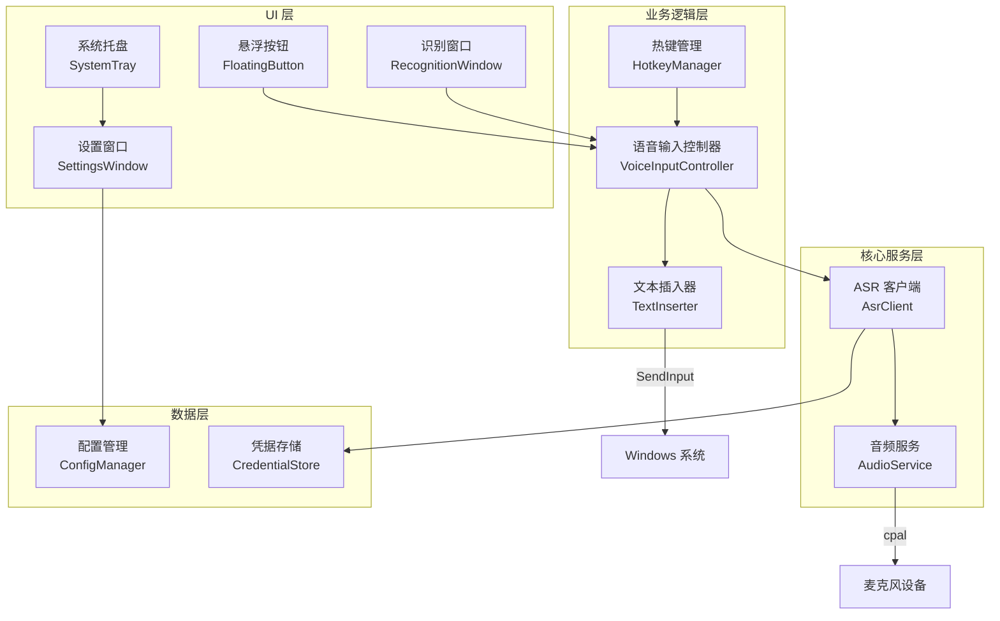

# Doubao Voice Input - 技术架构详细设计（简化版）

**版本**: v2.0（简化版）  
**创建日期**: 2026-02-05  
**设计理念**: 大道至简 - 专注纯粹的语音输入

---

## 一、技术选型

### 1.1 核心技术栈

```toml
[dependencies]
# Windows API 绑定（仅需基础 API）
windows = { version = "0.52", features = [
    "Win32_UI_Input_KeyboardAndMouse",
    "Win32_UI_WindowsAndMessaging",
    "Win32_Security_Cryptography"
] }

# 异步运行时
tokio = { version = "1.35", features = ["full"] }

# HTTP/WebSocket 客户端
reqwest = { version = "0.11", features = ["json", "rustls-tls"] }
tokio-tungstenite = { version = "0.21", features = ["rustls-tls-native-roots"] }

# 音频采集
cpal = "0.15"
rubato = "0.14"  # 音频重采样

# 全局热键
global-hotkey = "0.5"

# UI 框架（选项 1: Tauri）
tauri = { version = "1.5", features = ["system-tray", "window-all"] }
# 或选项 2: egui for native UI
# egui = "0.24"
# eframe = "0.24"

# 配置文件
serde = { version = "1.0", features = ["derive"] }
toml = "0.8"

# 日志
tracing = "0.1"
tracing-subscriber = "0.3"

# 错误处理
anyhow = "1.0"
thiserror = "1.0"

# UUID
uuid = { version = "1.6", features = ["v4"] }
```

> [!NOTE]
> **简化点**: 移除了 Windows TSF 相关依赖，只保留基础 Windows API

---

## 二、简化架构设计

### 2.1 架构图



### 2.2 目录结构（精简版）

```
src/
├── main.rs                    # 程序入口
│
├── ui/
│   ├── mod.rs
│   ├── floating_button.rs     # 悬浮按钮
│   ├── recognition_window.rs  # 识别状态窗口
│   ├── system_tray.rs         # 系统托盘
│   └── settings_window.rs     # 设置窗口
│
├── business/
│   ├── mod.rs
│   ├── voice_controller.rs    # 语音输入控制器
│   ├── text_inserter.rs       # 文本插入服务
│   └── hotkey_manager.rs      # 热键管理
│
├── asr/
│   ├── mod.rs
│   ├── client.rs              # ASR 客户端
│   ├── protocol.rs            # 协议定义
│   └── device_reg.rs          # 设备注册
│
├── audio/
│   ├── mod.rs
│   ├── capture.rs             # 音频采集
│   └── processor.rs           # PCM 处理
│
├── data/
│   ├── mod.rs
│   ├── config.rs              # 配置管理
│   └── credential.rs          # 凭据存储
│
└── utils/
    ├── mod.rs
    └── logger.rs              # 日志
```

---

## 三、核心模块详细设计

```rust
// src/business/voice_controller.rs
use tokio::sync::mpsc;
use std::sync::Arc;

pub struct VoiceInputController {
    asr_client: Arc<AsrClient>,
    audio_service: Arc<AudioService>,
    text_inserter: Arc<TextInserter>,
    is_recording: Arc<AtomicBool>,
    last_inserted_text: Arc<Mutex<String>>,  // 上次插入的文本
}

impl VoiceInputController {
    /// 启动语音输入
    pub async fn start_voice_input(&self) -> Result<()> {
        if self.is_recording.swap(true, Ordering::SeqCst) {
            return Ok(()); // 已在录音中
        }
        
        // 清空上次插入的文本
        self.last_inserted_text.lock().await.clear();
        
        // 1. 创建音频通道
        let (audio_tx, audio_rx) = mpsc::channel(100);
        
        // 2. 启动音频采集
        let capture_handle = self.audio_service.start_capture(audio_tx).await?;
        
        // 3. 启动 ASR 识别
        let result_rx = self.asr_client.start_realtime_asr(audio_rx).await?;
        
        // 4. 处理识别结果（实时插入）
        self.handle_asr_results(result_rx).await?;
        
        Ok(())
    }
    
    /// 停止语音输入
    pub async fn stop_voice_input(&self) -> Result<()> {
        self.is_recording.store(false, Ordering::SeqCst);
        Ok(())
    }
    
    /// 处理 ASR 识别结果（实时插入 + 动态修正）
    async fn handle_asr_results(
        &self,
        mut result_rx: mpsc::Receiver<AsrResponse>,
    ) -> Result<()> {
        while let Some(response) = result_rx.recv().await {
            match response.response_type {
                ResponseType::InterimResult => {
                    // 实时插入中间结果
                    if let Some(new_text) = response.text {
                        self.update_text(&new_text).await?;
                    }
                }
                ResponseType::FinalResult => {
                    // 最终结果也使用相同的更新逻辑
                    if let Some(new_text) = response.text {
                        self.update_text(&new_text).await?;
                    }
                }
                ResponseType::SessionFinished => {
                    // ASR 会话结束，自动停止录音
                    self.stop_voice_input().await?;
                    break;
                }
                _ => {}
            }
        }
        Ok(())
    }
    
    /// 更新文本（删除旧文本 + 插入新文本）
    async fn update_text(&self, new_text: &str) -> Result<()> {
        let mut last_text = self.last_inserted_text.lock().await;
        
        // 计算需要删除的字符数
        let chars_to_delete = last_text.chars().count();
        
        // 1. 先删除旧文本（模拟退格键）
        if chars_to_delete > 0 {
            self.text_inserter.delete_chars(chars_to_delete)?;
        }
        
        // 2. 插入新文本
        self.text_inserter.insert(new_text)?;
        
        // 3. 更新记录
        *last_text = new_text.to_string();
        
        Ok(())
    }
}
```

> [!IMPORTANT]
> **实时插入机制**:
> - `last_inserted_text`: 记录上次插入的文本
> - 每次收到新结果时，先删除旧文本（退格键），再插入新文本
> - 用户看到的是**无缝的文本更新**，而不是闪烁的删除/插入

### 3.2 文本插入服务（Windows SendInput + 退格）

```rust
// src/business/text_inserter.rs
use windows::Win32::UI::Input::KeyboardAndMouse::*;

pub struct TextInserter;

impl TextInserter {
    /// 插入文本到当前焦点窗口
    pub fn insert(&self, text: &str) -> Result<()> {
        let mut inputs = Vec::new();
        
        for ch in text.encode_utf16() {
            // Key down
            inputs.push(self.create_unicode_input(ch, true));
            // Key up
            inputs.push(self.create_unicode_input(ch, false));
        }
        
        unsafe {
            let sent = SendInput(
                &inputs,
                std::mem::size_of::<INPUT>() as i32
            );
            
            if sent != inputs.len() as u32 {
                return Err(anyhow!("Failed to send all inputs"));
            }
        }
        
        Ok(())
    }
    
    /// 删除指定数量的字符（模拟退格键）
    pub fn delete_chars(&self, count: usize) -> Result<()> {
        let mut inputs = Vec::new();
        
        for _ in 0..count {
            // Backspace key down
            inputs.push(self.create_key_input(VK_BACK, true));
            // Backspace key up
            inputs.push(self.create_key_input(VK_BACK, false));
        }
        
        unsafe {
            let sent = SendInput(
                &inputs,
                std::mem::size_of::<INPUT>() as i32
            );
            
            if sent != inputs.len() as u32 {
                return Err(anyhow!("Failed to delete all chars"));
            }
        }
        
        Ok(())
    }
    
    fn create_unicode_input(&self, ch: u16, key_down: bool) -> INPUT {
        INPUT {
            r#type: INPUT_KEYBOARD,
            Anonymous: INPUT_0 {
                ki: KEYBDINPUT {
                    wVk: VIRTUAL_KEY(0),
                    wScan: ch,
                    dwFlags: if key_down {
                        KEYEVENTF_UNICODE
                    } else {
                        KEYEVENTF_UNICODE | KEYEVENTF_KEYUP
                    },
                    time: 0,
                    dwExtraInfo: 0,
                },
            },
        }
    }
    
    fn create_key_input(&self, vk: VIRTUAL_KEY, key_down: bool) -> INPUT {
        INPUT {
            r#type: INPUT_KEYBOARD,
            Anonymous: INPUT_0 {
                ki: KEYBDINPUT {
                    wVk: vk,
                    wScan: 0,
                    dwFlags: if key_down { KEYEVENTF(0) } else { KEYEVENTF_KEYUP },
                    time: 0,
                    dwExtraInfo: 0,
                },
            },
        }
    }
}
```

> [!TIP]
> **退格键删除**:
> - 使用 `VK_BACK` （Backspace）键模拟删除
> - 删除 N 个字符需要发送 N 次退格键
> - 与 Unicode 插入结合，实现流式文本更新

---

### 3.3 全局热键管理（支持双击）

```rust
// src/business/hotkey_manager.rs
use global_hotkey::{GlobalHotKeyManager, hotkey::{Code, Modifiers, HotKey}};
use std::time::{Instant, Duration};

pub enum HotkeyMode {
    Combo,      // 组合键模式（如 Ctrl+Shift+V）
    DoubleTap,  // 双击模式（如双击 Ctrl）
}

pub struct HotkeyManager {
    manager: GlobalHotKeyManager,
    mode: HotkeyMode,
    combo_hotkey: Option<HotKey>,
    double_tap_key: Option<HotKey>,
    last_press_time: Arc<Mutex<Option<Instant>>>,
    double_tap_interval: Duration,
}

impl HotkeyManager {
    pub fn new(config: &HotkeyConfig) -> Result<Self> {
        let manager = GlobalHotKeyManager::new()?;
        let mode = config.mode.clone();
        
        let (combo_hotkey, double_tap_key) = match mode {
            HotkeyMode::Combo => {
                // 注册组合键（Ctrl+Shift+V）
                let hotkey = HotKey::new(
                    Some(Modifiers::CONTROL | Modifiers::SHIFT),
                    Code::KeyV,
                );
                manager.register(hotkey)?;
                (Some(hotkey), None)
            }
            HotkeyMode::DoubleTap => {
                // 注册单键（Ctrl）
                let hotkey = HotKey::new(None, Code::ControlLeft);
                manager.register(hotkey)?;
                (None, Some(hotkey))
            }
        };
        
        Ok(Self {
            manager,
            mode,
            combo_hotkey,
            double_tap_key,
            last_press_time: Arc::new(Mutex::new(None)),
            double_tap_interval: Duration::from_millis(config.double_tap_interval),
        })
    }
    
    /// 监听热键事件
    pub fn listen<F>(&self, callback: F)
    where
        F: Fn() + Send + Sync + 'static,
    {
        let receiver = GlobalHotKeyEvent::receiver();
        let mode = self.mode.clone();
        let last_press_time = self.last_press_time.clone();
        let double_tap_interval = self.double_tap_interval;
        let callback = Arc::new(callback);
        
        std::thread::spawn(move || {
            loop {
                if let Ok(event) = receiver.recv() {
                    match mode {
                        HotkeyMode::Combo => {
                            // 组合键直接触发
                            callback();
                        }
                        HotkeyMode::DoubleTap => {
                            // 检测双击
                            let now = Instant::now();
                            let mut last_time = last_press_time.lock().unwrap();
                            
                            if let Some(last) = *last_time {
                                let elapsed = now.duration_since(last);
                                if elapsed <= double_tap_interval {
                                    // 双击检测成功
                                    callback();
                                    *last_time = None;  // 重置
                                    continue;
                                }
                            }
                            
                            // 记录本次按键时间
                            *last_time = Some(now);
                        }
                    }
                }
            }
        });
    }
}
```

> [!TIP]
> **双击检测逻辑**:
> 1. 记录第一次按键时间 `last_press_time`
> 2. 第二次按键时，计算时间差
> 3. 若时间差 ≤ 300ms（可配置），触发语音输入
> 4. 否则视为新的第一次按键

---

### 3.4 ASR 客户端（简化版）

```rust
// src/asr/client.rs
use tokio::sync::mpsc;
use tokio_tungstenite::{connect_async, tungstenite::Message};

pub struct AsrClient {
    ws_url: String,
    token: String,
}

impl AsrClient {
    /// 启动实时语音识别
    pub async fn start_realtime_asr(
        &self,
        mut audio_rx: mpsc::Receiver<Vec<u8>>,
    ) -> Result<mpsc::Receiver<AsrResponse>> {
        let (ws_stream, _) = connect_async(&self.ws_url).await?;
        let (mut write, mut read) = ws_stream.split();
        
        let (result_tx, result_rx) = mpsc::channel(100);
        
        // 音频发送任务
        tokio::spawn(async move {
            while let Some(pcm_data) = audio_rx.recv().await {
                if write.send(Message::Binary(pcm_data)).await.is_err() {
                    break;
                }
            }
        });
        
        // 结果接收任务
        tokio::spawn(async move {
            while let Some(Ok(Message::Text(text))) = read.next().await {
                if let Ok(response) = parse_asr_response(&text) {
                    let _ = result_tx.send(response).await;
                }
            }
        });
        
        Ok(result_rx)
    }
}
```

---

### 3.5 悬浮按钮 UI

```rust
// src/ui/floating_button.rs
use tauri::Window;

pub struct FloatingButton {
    window: Window,
    is_recording: Arc<AtomicBool>,
}

impl FloatingButton {
    pub fn new() -> Result<Self> {
        let window = tauri::WindowBuilder::new(
            app,
            "floating-button",
            tauri::WindowUrl::App("index.html".into()),
        )
        .title("Voice Input")
        .inner_size(60.0, 60.0)  // 小圆形按钮
        .decorations(false)      // 无边框
        .always_on_top(true)     // 置顶
        .skip_taskbar(true)      // 不显示在任务栏
        .build()?;
        
        Ok(Self {
            window,
            is_recording: Arc::new(AtomicBool::new(false)),
        })
    }
    
    /// 切换录音状态
    pub fn toggle_recording(&self) {
        let recording = self.is_recording.fetch_xor(true, Ordering::SeqCst);
        
        // 更新按钮样式
        self.window.emit("recording-state-changed", !recording).ok();
    }
}
```

**悬浮按钮 HTML/CSS**:
```html
<!-- src-tauri/index.html -->
<!DOCTYPE html>
<html>
<head>
  <style>
    body {
      margin: 0;
      display: flex;
      justify-content: center;
      align-items: center;
      height: 100vh;
      background: transparent;
    }
    
    .mic-button {
      width: 50px;
      height: 50px;
      border-radius: 50%;
      background: linear-gradient(135deg, #667eea 0%, #764ba2 100%);
      border: none;
      cursor: pointer;
      display: flex;
      justify-content: center;
      align-items: center;
      transition: all 0.3s ease;
      box-shadow: 0 4px 15px rgba(0,0,0,0.2);
    }
    
    .mic-button:hover {
      transform: scale(1.1);
    }
    
    .mic-button.recording {
      background: linear-gradient(135deg, #f093fb 0%, #f5576c 100%);
      animation: pulse 1s infinite;
    }
    
    @keyframes pulse {
      0%, 100% { box-shadow: 0 0 0 0 rgba(245, 87, 108, 0.7); }
      50% { box-shadow: 0 0 0 10px rgba(245, 87, 108, 0); }
    }
  </style>
</head>
<body>
  <button class="mic-button" id="micBtn">
    🎤
  </button>
  
  <script>
    const btn = document.getElementById('micBtn');
    btn.addEventListener('click', () => {
      window.__TAURI__.invoke('toggle_voice_input');
    });
    
    window.__TAURI__.event.listen('recording-state-changed', (event) => {
      btn.classList.toggle('recording', event.payload);
    });
  </script>
</body>
</html>
```

---

## 四、配置管理

### 4.1 配置结构

```rust
// src/data/config.rs
use serde::{Deserialize, Serialize};

#[derive(Debug, Clone, Serialize, Deserialize)]
pub struct AppConfig {
    pub general: GeneralConfig,
    pub hotkey: HotkeyConfig,
    pub floating_button: FloatingButtonConfig,
    pub asr: AsrConfig,
}

#[derive(Debug, Clone, Serialize, Deserialize)]
pub struct GeneralConfig {
    pub auto_start: bool,
    pub language: String,
}

#[derive(Debug, Clone, Serialize, Deserialize)]
pub struct HotkeyConfig {
    pub mode: String,  // "combo" 或 "double_tap"
    pub combo_key: String,  // 组合键（如 "Ctrl+Shift+V"）
    pub double_tap_key: String,  // 双击键（如 "Ctrl"）
    pub double_tap_interval: u64,  // 双击间隔（毫秒）
}

#[derive(Debug, Clone, Serialize, Deserialize)]
pub struct FloatingButtonConfig {
    pub enabled: bool,
    pub position_x: i32,
    pub position_y: i32,
}

#[derive(Debug, Clone, Serialize, Deserialize)]
pub struct AsrConfig {
    pub vad_enabled: bool,
}
```

---

## 五、打包与部署

### 5.1 构建脚本

**scripts/build-portable.ps1**:
```powershell
# 清理之前的构建
cargo clean

# 编译 Release 版本（静态链接）
$env:RUSTFLAGS="-C target-feature=+crt-static"
cargo build --release --target x86_64-pc-windows-msvc

# 创建便携目录
$PortableDir = "dist/doubao-voice-portable"
New-Item -ItemType Directory -Force -Path $PortableDir

# 复制主程序
Copy-Item "target/x86_64-pc-windows-msvc/release/doubao-voice-input.exe" $PortableDir

# 复制配置模板
Copy-Item "config.toml.example" "$PortableDir/config.toml"

# 复制 README
Copy-Item "README.md" $PortableDir

# 打包 ZIP
Compress-Archive -Path $PortableDir -DestinationPath "doubao-voice-input-v1.0.0-portable.zip" -Force

Write-Host "✅ Portable build completed: doubao-voice-input-v1.0.0-portable.zip"
Write-Host "📦 Size: $((Get-Item doubao-voice-input-v1.0.0-portable.zip).Length / 1MB) MB"
```

### 5.2 Cargo.toml 优化

```toml
[profile.release]
opt-level = "z"         # 优化体积
lto = true              # 链接时优化
codegen-units = 1       # 单一代码生成单元
strip = true            # 移除符号
panic = "abort"         # 崩溃时直接退出
```

---

## 六、性能优化

### 6.1 内存优化
- 音频缓冲区使用固定大小环形缓冲区
- ASR 结果缓存最多保留最近 10 条
- UI 使用轻量级框架（Tauri 或 egui）

### 6.2 启动优化
- 延迟加载 ASR 客户端（首次使用时初始化）
- 异步加载配置文件
- 系统托盘快速启动

---

## 七、测试策略

### 7.1 单元测试

```rust
#[cfg(test)]
mod tests {
    use super::*;

    #[test]
    fn test_text_inserter() {
        let inserter = TextInserter;
        // 模拟测试（需人工验证）
        // inserter.insert("测试文本").unwrap();
    }
    
    #[tokio::test]
    async fn test_asr_device_registration() {
        let client = AsrClient::new("test_token");
        // 测试设备注册
    }
}
```

---

## 八、部署架构


---

## 九、与原架构对比

### 移除组件
- ❌ Windows TSF 框架（ITfTextInputProcessor 等）
- ❌ 候选词引擎
- ❌ 输入法状态机
- ❌ 用户词库管理
- ❌ 本地文件识别模块

### 简化结果
| 指标 | 原架构 | 简化版 |
|------|--------|--------|
| 代码模块数 | 15+ | 8 |
| 依赖数量 | 20+ | 12 |
| 预计包大小 | 30-50MB | 10-15MB |
| 开发时间 | 11 周 | 7 周 |

---

**最后更新**: 2026-02-05
