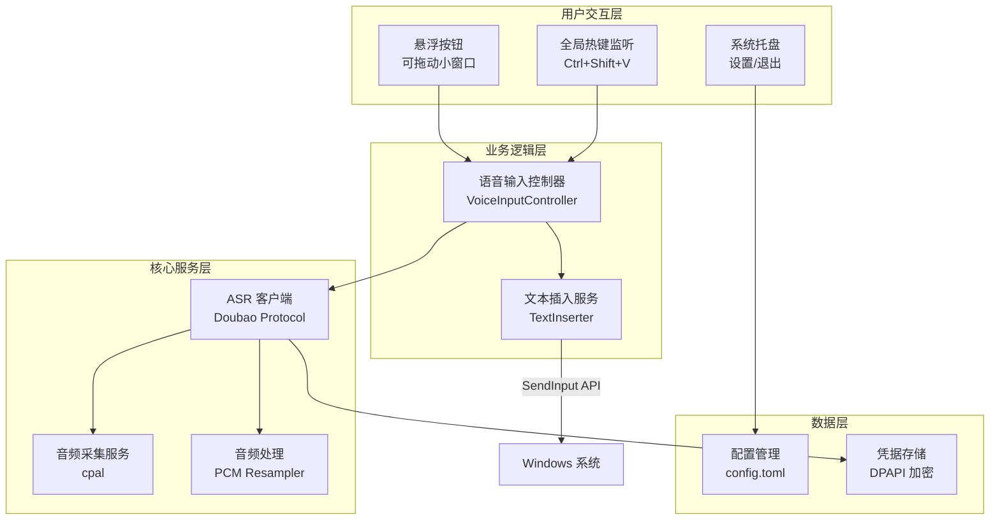
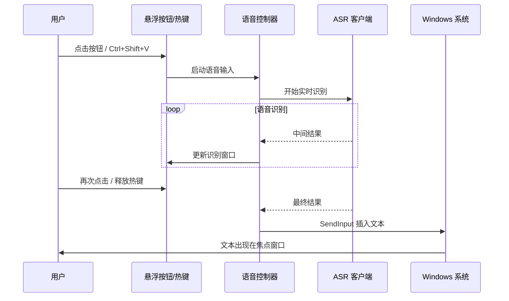

# Windows 豆包语音输入工具产品需求文档

**文档版本**: v2.0（简化版）  
**创建日期**: 2026-02-05  
**项目名称**: Doubao Voice Input（豆包语音输入）  
**参考项目**: [doubaoime-asr](https://github.com/starccy/doubaoime-asr)  
**设计理念**: 大道至简 - 专注纯粹的语音输入体验

---

## 一、项目背景与目标

### 1.1 项目背景
基于 [doubaoime-asr](https://github.com/starccy/doubaoime-asr) 项目，开发一款**极简的 Windows 语音输入工具**。不同于传统输入法，本项目专注于语音转文字这一核心功能。

### 1.2 项目目标
- 提供**纯粹的语音输入体验**，无传统 IME 复杂功能
- 支持**快捷键**和**悬浮按钮**两种触发方式
- 实现**绿色便携部署**，无需安装即可使用
- 保持**最小化功能集**，专注实时语音识别

### 1.3 核心价值主张
- **极简**: 功能单一纯粹，无冗余功能
- **便捷**: 快捷键或悬浮按钮一键启动
- **便携**: 绿色版，解压即用
- **智能**: 豆包 ASR 语音识别，支持标点符号

---

## 二、功能需求（精简版）

### 2.1 核心功能模块

#### 2.1.1 语音输入（唯一核心功能）
| 功能项 | 优先级 | 描述 |
|--------|--------|------|
| 快捷键触发 | P0 | 支持组合键（Ctrl+Shift+V）或双击 Ctrl 启动/停止 |
| 悬浮按钮触发 | P0 | 点击悬浮按钮启动/停止语音输入 |
| 实时麦克风识别 | P0 | 实时采集麦克风音频并识别 |
| 流式识别实时插入 | P0 | 中间结果直接插入到焦点窗口（实时可见） |
| 智能文本修正 | P0 | 当ASR修正时，删除旧文本并插入新文本（退格+重插） |
| 无缝编辑体验 | P0 | 用户全程关注输入框，无视线切换 |
| VAD（语音活动检测） | P1 | 自动检测语音开始和结束 |

> [!NOTE]
> **ASR 自带功能**: 豆包 ASR 接口返回的文本已包含标点符号，无需额外处理

> [!NOTE]
> **移除功能**: 不支持本地音频文件识别，仅支持实时麦克风输入

> [!IMPORTANT]
> **流式识别机制（实时插入）**: 
> - 识别过程中，中间结果**直接插入**到焦点窗口（用户实时可见）
> - 当 ASR 修正文本时（如"平果"→"苹果"），自动删除旧文本并重新插入
> - 删除操作使用退格键（Backspace）模拟，保证自然的编辑体验
> - 用户全程只需关注输入框，无需在识别窗口和输入框之间切换视线

#### 2.1.2 用户界面（最小化）
| 功能项 | 优先级 | 描述 |
|--------|--------|------|
| 悬浮按钮 | P0 | 可拖动的小型悬浮按钮（录音时显示动画效果） |
| 系统托盘图标 | P0 | 最小化到系统托盘，右键菜单（设置/退出） |
| 设置界面 | P1 | 简单的设置窗口（快捷键、悬浮按钮配置） |

> [!NOTE]
> **简化点**: 
> - 移除独立的识别状态窗口（识别结果直接在输入框显示）
> - 悬浮按钮录音时显示动画，用户即可知道正在录音
> - 无候选词窗口、无输入法状态切换、无主题切换

#### 2.1.3 配置与管理
| 功能项 | 优先级 | 描述 |
|--------|--------|------|
| 设备自动注册 | P0 | 首次运行自动注册设备并保存凭据 |
| 凭据本地存储 | P0 | 安全存储 device_id 和 token |
| 快捷键配置 | P1 | 支持组合键（Ctrl+Shift+V）或双击模式（双击 Ctrl） |
| 悬浮按钮开关 | P1 | 允许用户显示/隐藏悬浮按钮 |

---

### 2.2 非功能需求

#### 2.2.1 性能要求
- **语音识别延迟**: < 500ms
- **内存占用**: < 100MB（大幅降低）
- **CPU 使用率**: 待机 < 3%，识别时 < 15%
- **启动速度**: < 2 秒

#### 2.2.2 兼容性要求
- **操作系统**: Windows 10/11 (x64)
- **焦点窗口兼容**: 支持主流应用（记事本、Word、浏览器、VS Code 等）

#### 2.2.3 便携性要求
- **独立运行**: 无需 Python/Node.js 等运行时
- **绿色部署**: 单一可执行文件 + 配置文件
- **体积**: < 20MB（包含所有依赖）

#### 2.2.4 安全性要求
- **凭据加密**: Windows DPAPI 加密
- **网络安全**: HTTPS/WSS 通信
- **隐私**: 不记录语音数据

---

## 三、技术架构方案（简化版）

### 3.1 技术选型

**推荐方案**: Rust + Windows API

| 组件 | 技术 |
|------|------|
| 编程语言 | Rust |
| UI 框架 | `tauri`（悬浮按钮、设置界面）或 `egui` |
| 全局热键 | `global-hotkey` |
| 文本插入 | Windows `SendInput` API |
| 语音识别 | 移植 doubaoime-asr 协议 |
| 音频采集 | `cpal` |
| 异步运行时 | `tokio` |

> [!NOTE]
> **移除组件**: 不需要 Windows TSF 框架，大幅简化技术栈

---

### 3.2 简化架构设计



**模块说明**:
- **语音输入控制器**: 协调语音识别和文本插入
- **文本插入服务**: 使用 Windows SendInput API 模拟键盘输入
- **ASR 客户端**: 复用 doubaoime-asr 协议
- **无需 TSF**: 不实现传统 IME 框架

---

## 四、开发计划（简化版）

### 4.1 里程碑规划（7 周）

#### Phase 1: 基础框架（2 周）
- [ ] Rust 项目初始化
- [ ] 全局热键注册
- [ ] 系统托盘集成
- [ ] 悬浮按钮 UI

#### Phase 2: 语音识别集成（2 周）
- [ ] ASR 协议移植
- [ ] 音频采集与处理
- [ ] 实时语音识别测试

#### Phase 3: 文本插入与 UI（2 周）
- [ ] Windows SendInput 实现
- [ ] 识别状态窗口
- [ ] 设置界面

#### Phase 4: 打包与测试（1 周）
- [ ] 绿色打包
- [ ] 集成测试
- [ ] 性能优化

---

### 4.2 技术风险评估

| 风险项 | 风险等级 | 缓解措施 |
|--------|----------|----------|
| SendInput 兼容性问题 | 中 | 测试主流应用，提供降级方案 |
| 豆包 ASR 协议变更 | 中 | 协议版本检测 |
| 全局热键冲突 | 低 | 允许用户自定义 |

---

## 五、关键 API 与协议

### 5.1 Doubao ASR 协议（与原需求相同）

#### 设备注册
```
POST /register_device
→ 返回 token
```

#### 实时语音识别
```
WebSocket /asr/realtime
发送: PCM 音频数据（16kHz, 单声道）
接收: INTERIM_RESULT / FINAL_RESULT
```

### 5.2 Windows 文本插入 API

```rust
use windows::Win32::UI::Input::KeyboardAndMouse::*;

// 模拟键盘输入插入文本
fn insert_text(text: &str) {
    let mut inputs = vec![];
    for ch in text.encode_utf16() {
        // 构造 INPUT 结构
        inputs.push(create_unicode_input(ch, true));  // key down
        inputs.push(create_unicode_input(ch, false)); // key up
    }
    unsafe {
        SendInput(&inputs, size_of::<INPUT>() as i32);
    }
}
```

---

## 六、用户交互流程（简化版）

### 6.1 语音输入流程



---

## 七、配置文件结构（简化版）

### 7.1 config.toml
```toml
[general]
auto_start = false
language = "zh-CN"

[hotkey]
mode = "double_tap"  # "combo" 或 "double_tap"
combo_key = "Ctrl+Shift+V"  # 组合键模式
double_tap_key = "Ctrl"      # 双击键模式
double_tap_interval = 300    # 双击间隔（毫秒）

[floating_button]
enabled = true
position_x = 100  # 记忆位置
position_y = 100

[asr]
vad_enabled = true  # 语音活动检测
```

### 7.2 credentials.json（加密）
```json
{
  "device_id": "xxxxx",
  "token": "encrypted_token"
}
```

---

## 八、测试策略（简化版）

### 8.1 功能测试
- 热键触发测试（多种组合键）
- 悬浮按钮拖动与点击测试
- 文本插入测试（记事本、Word、浏览器）
- 语音识别准确率测试

### 8.2 性能测试
- 内存占用监控（目标 < 100MB）
- CPU 使用率测试
- 启动速度测试（目标 < 2s）

### 8.3 兼容性测试
- Windows 10/11 测试
- 主流应用兼容性测试

---

## 九、交付物清单（简化版）

- [ ] `doubao-voice-input.exe` - 主程序（单文件）
- [ ] `config.toml` - 配置文件
- [ ] `README.md` - 使用说明
- [ ] `LICENSE` - 开源协议

---

## 十、与原需求对比

### 移除功能
- ❌ 传统 IME 框架（Windows TSF）
- ❌ 候选词窗口
- ❌ 中英文切换
- ❌ 输入法状态管理
- ❌ 用户词库
- ❌ 本地音频文件识别
- ❌ 主题切换

### 保留核心
- ✅ 实时语音识别（豆包 ASR）
- ✅ 快捷键触发
- ✅ 悬浮按钮（新增）
- ✅ 绿色便携部署
- ✅ 凭据安全存储

### 开发时间
- **原计划**: 11 周
- **简化版**: 7 周（减少 36%）

---

## 附录

### A. 参考资源
- [doubaoime-asr](https://github.com/starccy/doubaoime-asr)
- [global-hotkey](https://github.com/tauri-apps/global-hotkey)
- [Windows SendInput API](https://learn.microsoft.com/en-us/windows/win32/api/winuser/nf-winuser-sendinput)

### B. 免责声明
> [!WARNING]
> 本项目基于豆包输入法客户端协议分析实现，非官方 API。
> - 仅供学习研究
> - 协议可能随时变更

---

**文档版本**: v2.0（简化版 - 大道至简）  
**最后更新**: 2026-02-05
